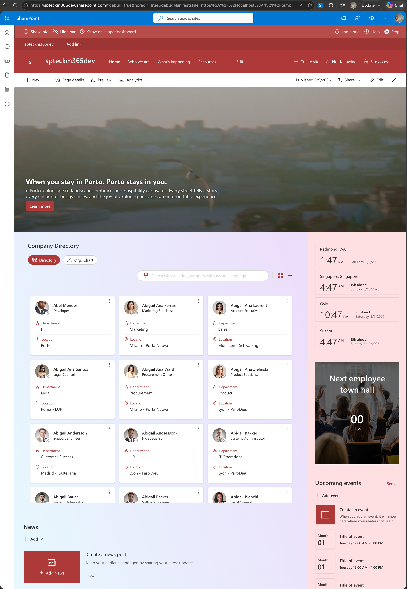

# React Hero Web Part

## Summary

A SharePoint Framework (SPFx) web part that displays a rich, fully configurable **Hero** banner with support for **7 layout modes**, image/video backgrounds, call-to-action links, auto-rotation, and full Fluent UI v9 theming. Built with [**@spteck/react-controls-v2**](https://www.npmjs.com/package/@spteck/react-controls-v2) and runs on SharePoint Online, Microsoft Teams, and Microsoft 365 (Office) hosts.




## Features

- **7 layout modes** — Fullscreen, Split, Featured, Mosaic, Grid, Filmstrip, Carousel
- **Image and video backgrounds** — SharePoint-hosted images, external images, YouTube, Vimeo, SharePoint Stream, and direct `.mp4` URLs
- **Per-tile configuration** — header text, description, call-to-action link, text position, overlay opacity, alt text
- **Auto-rotation** — interval-based or page-refresh rotation with configurable interval (ms)
- **Border radius control** — None, Small (2px), Medium (4px), Large (8px), X-Large (12px), Circular
- **Mosaic overflow mode** — Marquee or Scroll for overflowing tile content
- **Height slider** — 200–900 px (SharePoint pages); auto full-height in Teams/M365
- **Drag-and-drop tile reordering** — powered by [@dnd-kit](https://dndkit.com/)
- **Multi-host support** — SharePoint Web Part, SharePoint Full-Page App, Teams Personal App, Teams Tab
- **Theme-aware** — adapts to SharePoint themes and Teams light/dark/high-contrast themes automatically
- **Localized UI** — English (en-US), Portuguese (pt-PT and pt-BR), Spanish (es-ES), French (fr-FR), German (de-DE), Danish (da-DK), Finnish (fi-FI), Swedish (sv-SE)

## Compatibility

| :warning: Important          |
|:---------------------------|
| Every SPFx version is optimally compatible with specific versions of Node.js. In order to be able to build this sample, you need to ensure that the version of Node on your workstation matches one of the versions listed in this section. This sample will not work on a different version of Node.|
|Refer to <https://aka.ms/spfx-matrix> for more information on SPFx compatibility.   |

This sample is optimally compatible with the following environment configuration:


-Incompatible-red.svg "SharePoint Server 2016 Feature Pack 2 requires SPFx 1.1")


## Version history

| Version | Date | Comments |
| ------- | ---- | -------- |
| 1.0 | May 10, 2026 | Update comment |


## Contributors

- [João Mendes](https://github.com/joaojmendes)

## Supported Hosts

| Host | Supported |
| ---- | --------- |
| SharePoint Web Part | Yes |
| SharePoint Full-Page App | Yes |
| Microsoft Teams Tab | Yes |
| Microsoft Teams Personal App | Yes |

## Prerequisites

- Node.js **>=18.17.1 <19.0.0** or **>=20.9.0 <21.0.0**
- [Heft CLI](https://www.npmjs.com/package/@rushstack/heft) (installed locally by `npm install`)

## Getting Started

### 1. Clone and install

```bash
git clone https://github.com/pnp/sp-dev-fx-webparts.git
cd sp-dev-fx-webparts/samples/react-hero
npm install
```

### 2. Run locally

```bash
npm run start
```

Then open the SharePoint-hosted workbench:
`https://<tenant>.sharepoint.com/sites/<site>/_layouts/15/workbench.aspx`

### 3. Build for production

```bash
npm run build
```

The `.sppkg` package is output to the `release/solution/` folder.

### 4. Deploy

1. Upload the `.sppkg` file to your SharePoint **App Catalog**
2. Trust the solution when prompted
3. Add the **Hero** web part to any SharePoint page, Teams tab, or Teams personal app

## Configuration

Open the web part property pane by clicking **Edit**. The property pane is organized into two collapsible groups:

### Layout Options (expanded by default)

| Setting | Description |
| ------- | ----------- |
| **Layout** | Choose from 7 visual layouts (see below) |
| **Height (px)** | Slider (200–900 px) to control the banner height on SharePoint pages. In Teams and full-page apps the banner fills the available viewport height automatically. |
| **Border radius** | Rounds the corners of image tiles: None, Small (2px), Medium (4px), Large (8px), X-Large (12px), or Circular |
| **Overflow mode** | *(Mosaic layout only)* Controls how long titles overflow: **Marquee** (scrolling text) or **Scroll** (scrollable container) |
| **Enable rotation** | Enables automatic cycling between tiles |
| **Rotation mode** | **Interval** — auto-advances every N ms; **Refresh** — advances on each page load |
| **Interval (ms)** | *(Interval mode only)* Time in milliseconds between tile advances (default: 5000 ms) |

### Tiles (collapsed by default)

Manages the list of hero tiles. Each tile supports:

| Setting | Description |
| ------- | ----------- |
| **Background media** | Image or Video |
| **Image URL** | Direct URL to an image (`.jpg`, `.png`, SharePoint document library URL) |
| **Video URL** | YouTube, Vimeo, SharePoint Stream, or direct `.mp4` URL |
| **Alt text** | Accessibility description for the background image |
| **Header text** | Main title displayed over the tile |
| **Description** | Optional secondary text |
| **Show call to action** | Toggle a link button on the tile |
| **Call to action text** | Button label (default: "Learn more") |
| **Call to action link** | Destination URL |
| **Text position** | Where header/description text appears on the tile |
| **Overlay opacity** | Darkness of the image overlay behind the text (0–1) |
| **Autoplay** | *(Video only)* Muted autoplay — YouTube/Vimeo play as ambient background video |
| **Loop** | *(Video only)* Loop the video continuously |
| **Show video controls** | *(Video only)* Show or hide the native video player controls |

Tiles can be reordered by **drag and drop** or using the **Move Up / Move Down** buttons.

## Layout Reference

| Layout | Description |
| ------ | ----------- |
| **Fullscreen** | Single tile spanning the full width with an overlay caption bar |
| **Split** | Two equal-width tiles side by side |
| **Featured** | One large tile on the left, two stacked tiles on the right |
| **Mosaic** | Asymmetric mosaic — one large tile, two medium tiles, one wide bottom tile |
| **Grid** | 3 × 2 uniform grid of tiles |
| **Filmstrip** | One large featured tile above a row of thumbnail tiles |
| **Carousel** | Single tile with left/right navigation arrows and dot indicators |

## Height Behavior

| Environment | Height Behavior |
| ----------- | --------------- |
| SharePoint page (regular) | Fixed height from the slider (default: 480 px) |
| SharePoint full-page app | Dynamic — fills available viewport |
| Microsoft Teams tab | Dynamic — fills available viewport |
| Microsoft Teams personal app | Dynamic — fills available viewport |

## Localization

The web part ships with full translations for all UI strings:

| Language | Locale |
| -------- | ------ |
| English (US) | `en-us.js` |
| Portuguese (Portugal) | `pt-pt.js` |
| Portuguese (Brazil) | `pt-br.js` |
| Spanish (Spain) | `es-es.js` |
| French (France) | `fr-fr.js` |
| German (Germany) | `de-de.js` |
| Danish (Denmark) | `da-dk.js` |
| Finnish (Finland) | `fi-fi.js` |
| Swedish (Sweden) | `sv-se.js` |

## Project Structure

```
src/
  assets/
    hero1.png … hero7.png          # Sample/placeholder images
    welcome-dark.png               # Placeholder shown in dark theme when no tile is configured
    welcome-light.png              # Placeholder shown in light theme when no tile is configured
  components/
    HeroWebPartRoot.tsx            # Root component — renders the correct layout
    useHeroWebPartRootStyles.ts    # Root-level styles
    PlaceHolder/                   # Empty-state placeholder component
  constants/
    constants.ts                   # Layout SVGs, layout option definitions
  models/
    IHeroWebPartProps.ts           # Web part properties interface
    IHeroWebPartRootProps.ts       # Root component props
    IHeroProps.ts                  # Hero component props
    IHeroItemDetailProps.ts        # Tile detail panel props
    IHeroItemRowProps.ts           # Tile row props
    IHeroItemsManagerProps.ts      # Items manager props
    IBorderRadiusProps.ts          # Border radius control props
    IHeightProps.ts                # Height control props
    IMosaicOverflowProps.ts        # Mosaic overflow control props
    IRotationProps.ts              # Rotation control props
    SPFxHostType.ts                # Host type enum (sharepoint | teams | outlook)
  PropertyFields/
    BorderRadius/                  # Custom property pane field — border radius picker
    Height/                        # Custom property pane field — height slider
    HeroItemsManager/              # Custom property pane field — tile list manager
      HeroItemDetail.tsx           # Per-tile detail form (media, text, CTA, video options)
      HeroItemRow.tsx              # Tile row with drag handle, expand/collapse, reorder
      HeroItemsManagerHost.tsx     # Orchestrates the tile list + add button
      HeroItemsManagerField.ts     # SPFx property pane field wrapper
    MosaicOverflow/                # Custom property pane field — overflow mode picker
    Rotation/                      # Custom property pane field — rotation settings
  store/
    heroAtoms.ts                   # Jotai atoms for shared web part state
  utils/
    useUtils.ts                    # SharePoint URL resolver utility
  webparts/
    hero/
      HeroWebPart.tsx              # SPFx web part class
      HeroWebPart.manifest.json    # Manifest (hosts, icon, preconfigured entries)
      loc/                         # Localization files (9 languages)
assets/
  hero1.png … hero7.png            # Documentation screenshots
```

## Technology Stack

| Technology | Purpose |
| ---------- | ------- |
| [SPFx 1.22.2](https://aka.ms/spfx) | SharePoint Framework |
| [@spteck/react-controls-v2](https://www.npmjs.com/package/@spteck/react-controls-v2) | Hero layout and tile rendering |
| [@spteck/react-controls-v2-spfx-adapter](https://www.npmjs.com/package/@spteck/react-controls-v2-spfx-adapter) | SPFx context adapter for react-controls-v2 |
| [@fluentui/react-components 9.x](https://react.fluentui.dev/) | Fluent UI v9 components |
| [@fluentui/react-migration-v8-v9](https://www.npmjs.com/package/@fluentui/react-migration-v8-v9) | SPFx v8 theme → Fluent v9 theme conversion |
| [@dnd-kit/core + sortable](https://dndkit.com/) | Drag-and-drop tile reordering in the property pane |
| [@emotion/css](https://emotion.sh/) | CSS-in-JS for dynamic theming |
| [jotai](https://jotai.org/) | Lightweight atom-based state management |
| [Heft](https://heft.rushstack.io/) | Build toolchain (replaces Gulp in SPFx 1.22+) |

## Disclaimer

**THIS CODE IS PROVIDED _AS IS_ WITHOUT WARRANTY OF ANY KIND, EITHER EXPRESS OR IMPLIED, INCLUDING ANY IMPLIED WARRANTIES OF FITNESS FOR A PARTICULAR PURPOSE, MERCHANTABILITY, OR NON-INFRINGEMENT.**

## References

- [Getting started with SharePoint Framework](https://docs.microsoft.com/sharepoint/dev/spfx/set-up-your-developer-tenant)
- [Building for Microsoft Teams](https://docs.microsoft.com/sharepoint/dev/spfx/build-for-teams-overview)
- [Use Microsoft Graph in your solution](https://docs.microsoft.com/sharepoint/dev/spfx/web-parts/get-started/using-microsoft-graph-apis)
- [Publish SharePoint Framework applications to the Marketplace](https://docs.microsoft.com/sharepoint/dev/spfx/publish-to-marketplace-overview)
- [Microsoft 365 Patterns and Practices](https://aka.ms/m365pnp) - Guidance, tooling, samples and open-source controls for your Microsoft 365 development
- [Heft Documentation](https://heft.rushstack.io/)


> Any special pre-requisites?

## Solution

| Solution    | Author(s)                                               |
| ----------- | ------------------------------------------------------- |
| folder name | Author details (name, company, twitter alias with link) |

## Version history

| Version | Date             | Comments        |
| ------- | ---------------- | --------------- |
| 1.1     | March 10, 2021   | Update comment  |
| 1.0     | January 29, 2021 | Initial release |

## Disclaimer

**THIS CODE IS PROVIDED _AS IS_ WITHOUT WARRANTY OF ANY KIND, EITHER EXPRESS OR IMPLIED, INCLUDING ANY IMPLIED WARRANTIES OF FITNESS FOR A PARTICULAR PURPOSE, MERCHANTABILITY, OR NON-INFRINGEMENT.**

---

## Minimal Path to Awesome

- Clone this repository
- Ensure that you are at the solution folder
- in the command-line run:
  - `npm install -g @rushstack/heft`
  - `npm install`
  - `heft start`

> Include any additional steps as needed.

Other build commands can be listed using `heft --help`.

## Features

Description of the extension that expands upon high-level summary above.

This extension illustrates the following concepts:

- topic 1
- topic 2
- topic 3

> Notice that better pictures and documentation will increase the sample usage and the value you are providing for others. Thanks for your submissions advance.

> Share your web part with others through Microsoft 365 Patterns and Practices program to get visibility and exposure. More details on the community, open-source projects and other activities from http://aka.ms/m365pnp.

## References

- [Getting started with SharePoint Framework](https://docs.microsoft.com/sharepoint/dev/spfx/set-up-your-developer-tenant)
- [Building for Microsoft teams](https://docs.microsoft.com/sharepoint/dev/spfx/build-for-teams-overview)
- [Use Microsoft Graph in your solution](https://docs.microsoft.com/sharepoint/dev/spfx/web-parts/get-started/using-microsoft-graph-apis)
- [Publish SharePoint Framework applications to the Marketplace](https://docs.microsoft.com/sharepoint/dev/spfx/publish-to-marketplace-overview)
- [Microsoft 365 Patterns and Practices](https://aka.ms/m365pnp) - Guidance, tooling, samples and open-source controls for your Microsoft 365 development
- [Heft Documentation](https://heft.rushstack.io/)