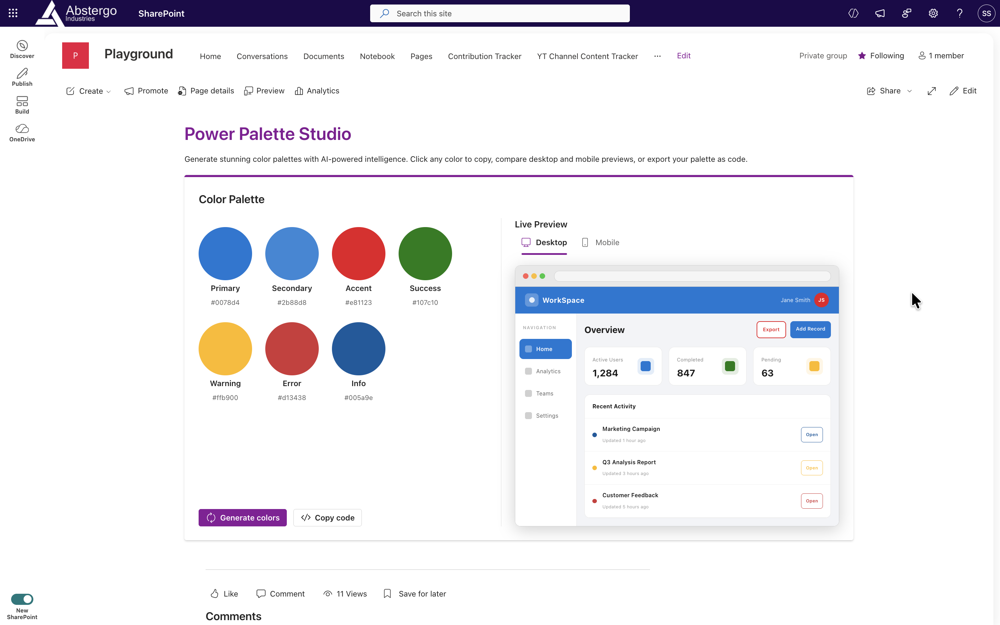
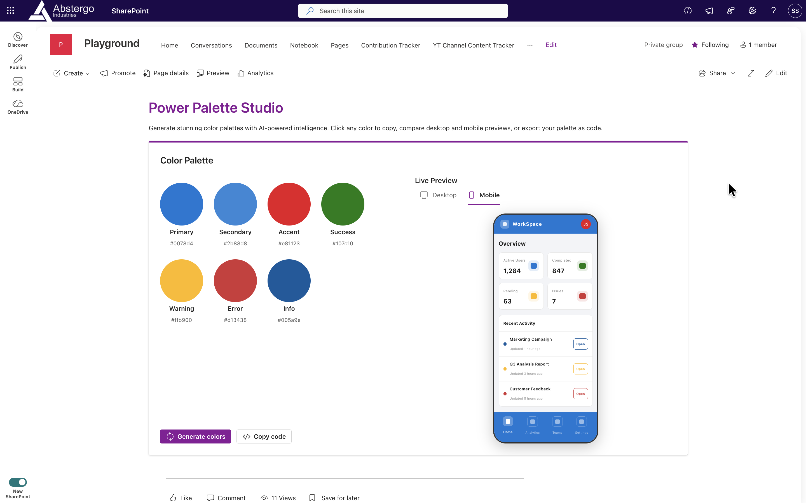
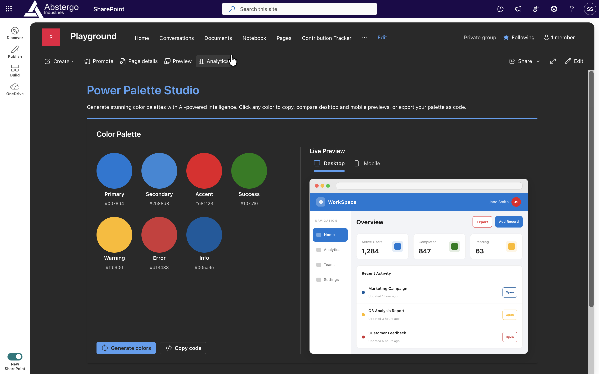

# Power Palette Studio

## Summary

A SharePoint Framework (SPFx) web part that lets you generate, customize, and preview color palettes for Power Apps themes — all within SharePoint. Choose colors, fine-tune them with an interactive HSL picker, and instantly see how they look applied to a realistic dashboard in desktop and mobile views. When you're happy with your palette, copy the ready-to-paste Power Apps `ColorValue` formula with one click.





## Features

- **Harmonious palette generation** — one click produces a random 7-color palette (Primary, Secondary, Accent, Success, Warning, Error, Info) using HSL-based color theory
- **Interactive HSL color picker** — click any swatch to open a color area with hue and saturation sliders powered by Fluent UI v9
- **Live dashboard preview** — toggle between a scaled desktop browser mockup and a phone frame mockup, both themed with your palette in real time
- **Responsive layout** — auto-switches to mobile preview when the available column width is too narrow for the desktop layout
- **Copy hex values** — click any hex label to copy that color to the clipboard with a toast confirmation
- **Export Power Apps theme** — generates a ready-to-use `ColorValue()` formula and opens it in a dialog for copying
- **Theme-aware** — adapts to SharePoint light and dark themes via Fluent UI v9

## Compatibility

| :warning: Important          |
|:---------------------------|
| Every SPFx version is optimally compatible with specific versions of Node.js. In order to be able to build this sample, you need to ensure that the version of Node on your workstation matches one of the versions listed in this section. This sample will not work on a different version of Node.|
|Refer to <https://aka.ms/spfx-matrix> for more information on SPFx compatibility.   |

This sample is optimally compatible with the following environment configuration:


-Incompatible-red.svg "SharePoint Server 2016 Feature Pack 2 requires SPFx 1.1")


## Contributors

- [Sandeep-FED](https://github.com/Sandeep-FED)

## Version History

| Version | Date       | Comments        |
| ------- | ---------- | --------------- |
| 1.0.0   | April 2026 | Initial release |

## Supported Hosts

| Host                        | Supported |
| --------------------------- | --------- |
| SharePoint Web Part         | Yes       |
| SharePoint Full-Page App    | No        |
| Microsoft Teams Tab         | No        |
| Microsoft Teams Personal App| No        |

## Prerequisites

- Node.js **>=22.14.0 < 23.0.0**
- A Microsoft 365 tenant with SharePoint Online
- [Power Apps](https://make.powerapps.com/) access (to use the exported theme formula)

## Getting Started

### 1. Install dependencies

```bash
git clone <repo-url>
cd react-powerapps-power-palette
npm install
```

### 2. Run locally

```bash
gulp serve
```

Then open the SharePoint workbench:
`https://<tenant>.sharepoint.com/sites/<site>/_layouts/15/workbench.aspx`

Add the **Power Palette Studio** web part to the canvas.

### 3. Build for production

```bash
gulp bundle --ship && gulp package-solution --ship
```

The `.sppkg` package will be output to the `sharepoint/solution/` folder.

### 4. Deploy

1. Upload the `.sppkg` file to your SharePoint **App Catalog**
2. Trust the solution when prompted
3. Add the **Power Palette Studio** web part to any SharePoint page

## Usage

### Generating a Palette

Click the **Generate** button in the header to create a new harmonious 7-color palette. Colors are generated using HSL-based color theory to ensure visual harmony.

### Customizing Colors

Click any color swatch to open the HSL color picker. Use:
- **Color area** — drag to set hue and saturation visually
- **Hue slider** — fine-tune the hue angle (0–360°)
- **Saturation slider** — adjust color intensity

The dashboard preview updates in real time as you drag.

### Previewing Your Theme

The **Dashboard Preview** panel shows a realistic mockup themed with your palette:
- **Desktop view** — a browser-chrome frame with a sidebar, stat cards, and activity list
- **Mobile view** — a phone frame with a stacked layout and bottom navigation bar

Toggle between views using the toolbar buttons above the preview. The web part automatically switches to mobile preview when the available column width is too narrow.

### Copying Colors

- **Single color** — click the hex label below any swatch to copy that value; a toast notification confirms the copy
- **Full theme formula** — click **Copy Code** to generate a complete Power Apps `ColorValue()` theme object and open it in a dialog

### Using in Power Apps

Paste the copied formula into your Power Apps app's **OnStart** property or a named formula to apply the theme to all controls.

## Project Structure

```
src/
  webparts/
    powerPaletteStudio/
      App.tsx                        # Root component — layout and state coordination
      App.module.scss                # Root layout styles
      PowerPaletteStudioWebPart.ts   # SPFx web part class
      PowerPaletteStudioWebPart.manifest.json
      components/
        ChooseColors.tsx             # Color palette grid with swatch cards
        ColorPicker.tsx              # HSL color picker (color area + sliders)
        CopyToast.tsx                # Clipboard copy toast notification
        DashboardPreview.tsx         # Desktop and mobile dashboard mockup
        Header.tsx                   # Title bar with Generate and Copy Code actions
        PreviewCode.tsx              # Power Apps formula dialog
        Swatches.tsx                 # Individual color swatch card
      models/
        IApp.ts                      # App-level props/state interfaces
        IColors.ts                   # Palette color definition interfaces
      utils/
        color.ts                     # HSL ↔ hex conversion and palette generation
      loc/
        en-us.js                     # English localization strings
        mystrings.d.ts               # Localization type definitions
```

## Technology Stack

| Technology | Purpose |
| ---------- | ------- |
| [SPFx 1.21.1](https://aka.ms/spfx) | SharePoint Framework |
| [React 17](https://reactjs.org/) | Component model |
| [@fluentui/react-components 9.x](https://react.fluentui.dev/) | Fluent UI v9 (ColorPicker, Dialog, Toast, etc.) |
| [@fluentui/react-icons](https://www.npmjs.com/package/@fluentui/react-icons) | Icon set |
| [@fluentui/react-migration-v8-v9](https://www.npmjs.com/package/@fluentui/react-migration-v8-v9) | SPFx v8 theme → Fluent v9 theme conversion |
| [Griffel / `makeStyles`](https://griffel.js.org/) | CSS-in-JS styling via Fluent UI |
| [Gulp](https://gulpjs.com/) | Build toolchain |
| [TypeScript 5.3](https://www.typescriptlang.org/) | Type-safe development |

## Disclaimer

**THIS CODE IS PROVIDED _AS IS_ WITHOUT WARRANTY OF ANY KIND, EITHER EXPRESS OR IMPLIED, INCLUDING ANY IMPLIED WARRANTIES OF FITNESS FOR A PARTICULAR PURPOSE, MERCHANTABILITY, OR NON-INFRINGEMENT.**

## References

- [Getting started with SharePoint Framework](https://docs.microsoft.com/sharepoint/dev/spfx/set-up-your-developer-tenant)
- [Fluent UI v9 React Components](https://react.fluentui.dev/)
- [Power Apps theming and color functions](https://learn.microsoft.com/en-us/power-apps/maker/canvas-apps/functions/function-colors)
- [Microsoft 365 Patterns and Practices](https://aka.ms/m365pnp) - Guidance, tooling, samples and open-source controls for your Microsoft 365 development


